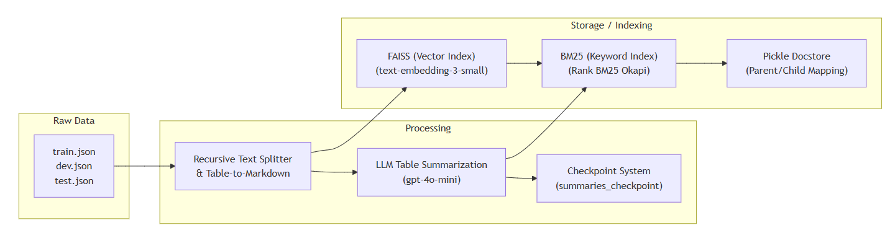
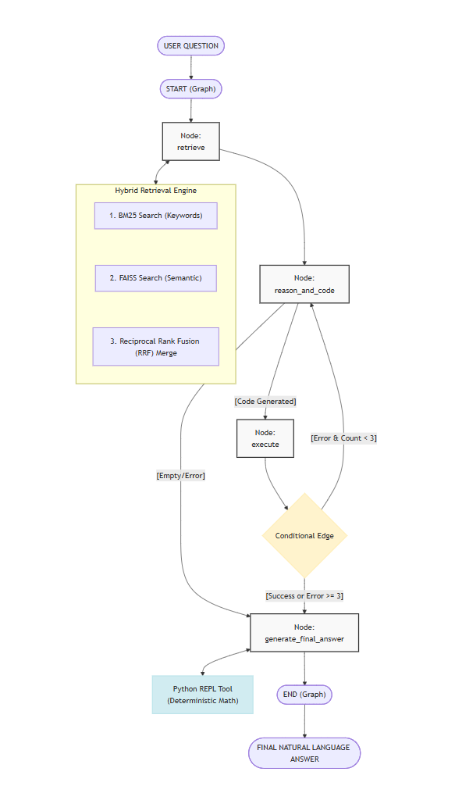
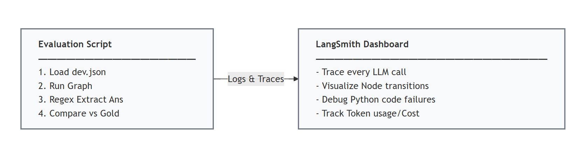

# finqa-agentic-rag

Terminal-only FinQA chatbot built as an Agentic-RAG system with LangGraph, hybrid retrieval, and deterministic Python execution for financial calculations.

## Prerequisites

- Python 3.10+
- OpenAI API key with roughly $5 of available credit
- FinQA dataset files: `train.json`, `dev.json`, `test.json`

## Installation

```bash
pip install -r requirements.txt
```

## Data Setup

Clone or download the FinQA dataset from <https://github.com/czyssrs/FinQA> and place these files in `data/`:

- `data/train.json`
- `data/dev.json`
- `data/test.json`

## Environment

Copy `.env.example` to `.env` and fill in your keys:

```env
OPENAI_API_KEY=your_openai_key
LANGCHAIN_TRACING_V2=true
LANGCHAIN_API_KEY=your_langsmith_key
LANGCHAIN_PROJECT=finqa-agentic-rag
```

## Run The Chatbot

The chatbot auto-ingests on first run. If `data/faiss_index/` already exists, it loads the persisted index instead of rebuilding it.

```bash
python src/main.py
```

## Run Evaluation

Default 100-sample evaluation:

```bash
python src/eval.py
```

Quick test:

```bash
python src/eval.py --samples 5
```

Optional pooled retrieval stress test:

```bash
python src/eval.py --samples 20 --pooled-eval
```

## Production Serving Note

For GPU production serving, vLLM can replace the OpenAI-hosted reasoning model as a drop-in OpenAI-compatible endpoint. For local CPU inference, Ollama is the practical equivalent. In production, OpenAI embeddings would typically be replaced by TEI or Infinity, and Python execution should move to a sandbox such as E2B or an isolated container.

## Architecture

```text
START --> retrieve --> reason_and_code --> execute
                       ^                 |
                       |  error < 3      |
                       +-----------------+
                                         |
                                         | success OR error >= 3
                                         v
                               generate_final_answer --> END
```

## Architecture Diagrams

### Data Ingestion And Persistence



### Inference And Agentic Loop



### Evaluation And Monitoring



## Data Understanding

### What characteristics define this dataset? What assumptions are you making?

The FinQA dataset comprises S&P 500 earnings reports (train.json, dev.json, test.json). Each sample contains unstructured pre-text/post-text paragraphs and structured HTML-origin tables. Questions require multi-step numerical reasoning (addition, subtraction, division, percentages) spanning both modalities. Ground truth answers are stored as floats or percentage strings in `sample["qa"]["exe_ans"]`.

The system relies on four core assumptions:

- **Self-Contained Context:** A sample's pre_text, post_text, and table contain all variables necessary to compute the answer; no cross-sample information is required.
- **Tabular Integrity:** Tables can be serialized into Markdown without losing row/column spatial meaning, provided they are kept intact and never chunked.
- **Chunking Mapping:** Paragraph-level chunking (only splitting if a paragraph exceeds 512 tokens) maintains a strict 1:1 mapping with the dataset's gold_inds keys (e.g., text_3, table_0), which is critical for accurate retrieval evaluation.
- **Evaluation Modality:** Evaluation can rely purely on numerical matching of the final output rather than comparing the dataset's domain-specific language (DSL) programs against standard Python code.

### What makes financial QA unique vs. general domain QA?

General domain QA typically extracts or summarizes text, where an approximately correct paraphrase is acceptable. Financial QA requires exact mathematical computation. A hallucinated or rounded number is catastrophically wrong, not merely imprecise. Furthermore, answers require bridging two distinct modalities: identifying the correct variables from structured tabular cells and unstructured textual context, then formulating and executing a precise arithmetic equation. This strict requirement for deterministic numerical correctness and cross-modality fusion separates financial QA from standard extractive or abstractive tasks.

---

## Method Selection

### What approaches did you consider (pros/cons)? Why did you choose your approach?

Four approaches were evaluated:

1. **Standard RAG:** Simple to implement, but LLMs hallucinate frequently when performing multi-step arithmetic internally.
2. **Fine-Tuning:** Improves domain familiarity but does not eliminate arithmetic errors, is slow to iterate, and exceeds the $5 budget constraint.
3. **Prompt Engineering (CoT):** Improves step-by-step reasoning but still relies on the LLM's flawed internal calculator.
4. **Agentic-RAG with Code Execution:** Separates reasoning from computation. The LLM writes Python code, and a deterministic REPL executes it, eliminating arithmetic hallucinations entirely.

**Rationale:** Agentic-RAG was chosen and implemented via a fault-tolerant LangGraph cyclic graph. The graph features four nodes (retrieve, reason_and_code, execute, generate_final_answer) with explicit conditional edges for a retry loop (up to 3 execution errors). To stay under the $5 budget, gpt-4o-mini is used for reasoning and code generation (20× cheaper than GPT-4o).

For retrieval, a Hybrid Multi-Vector approach is used: tables are summarized by the LLM, and the summaries are embedded in FAISS. However, the retriever returns the full raw Markdown table to the agent. This is merged with a BM25 keyword search using Reciprocal Rank Fusion (RRF) with explicit parent-document deduplication, ensuring the LLM receives complete, highly relevant tabular and textual data.

---

## Evaluation

### How do you measure the LLM answer correctness? What other metrics matter?

The primary metric is Execution Accuracy (Exact Match). The agent's final answer string is parsed using a regex (`r"[-+]?\d+\.?\d*|[-+]?\.\d+"`) to extract the last numerical value. A prediction is correct if `abs(predicted - ground_truth) <= 1e-4`.

To handle percentage ambiguities, a strict single-step percentage normalization fallback is applied: if direct comparison fails, `predicted * 100` and `predicted / 100` are checked against the ground truth. No further chaining is allowed, preventing false positives from double-normalization.

Four additional metrics are tracked:

- **Retrieval Precision & Recall (macro-averaged):** Computed per-sample by comparing retrieved document metadata (`type_chunkindex`) against gold evidence keys (`sample["qa"]["gold_inds"]`).
- **Pooled Hard Mode:** An optional evaluation variant (`--pooled-eval`) that clusters 10 samples into a single index to stress-test retrieval difficulty beyond the standard per-sample scoped retrieval.
- **Average Latency:** Wall-clock time per question.
- **Token Cost:** Tracked end-to-end via LangSmith.

### How do you evaluate numerical reasoning quality?

Beyond exact-match accuracy, an LLM-as-a-Judge metric is computed on a 10-sample subset to evaluate logical consistency. gpt-4o (chosen for maximum judgment quality while keeping costs at ~$0.05) receives the question, ground truth answer, the agent's generated code, and the final answer. It judges whether the agent retrieved the correct data and reasoned correctly, returning "Yes" or "No" with a one-sentence justification. The "Yes" ratio is reported as the Reasoning Quality Score. This metric is crucial because it identifies false positives (arriving at the right number through flawed logic/lucky cancellation) and false negatives (sound reasoning applied to the wrong retrieved variable).

---

## Production

### How would you monitor performance and detect drift?

Every LangGraph execution is traced end-to-end in LangSmith (configured via `LANGCHAIN_TRACING_V2=true` and `LANGCHAIN_PROJECT="finqa-agentic-rag"`). This captures node execution order, token counts, tool inputs/outputs, execution errors, and latency.

Two primary drift signals are monitored:

- **Tool Error Rate:** If the `PythonAstREPLTool` failure rate rises above 10%, it indicates the LLM is generating malformed code, likely due to input document format drift or model behavior degradation.
- **Exact Match Accuracy:** Evaluated on a weekly holdout sample. A drop of >5 percentage points triggers a manual review of the LangSmith traces.

### What's your plan for maintaining/improving the system?

The system is designed with modular, drop-in replacements for production scaling:

- **Model Serving:** The OpenAI API calls can be seamlessly replaced by vLLM in a GPU environment (e.g., serving Meta-Llama-3-8B-Instruct) or Ollama on CPU. Only the `base_url` and `model` parameters change; the LangGraph code remains identical.
- **Embeddings:** OpenAI embeddings (text-embedding-3-small) will be replaced by Text Embeddings Inference (TEI) or Infinity.
- **Execution Security:** The local `PythonAstREPLTool` must be replaced by a sandboxed environment like E2B (`e2b_code_interpreter`) or an isolated Docker container to prevent Arbitrary Code Execution (ACE) vulnerabilities.
- **Retrieval Scaling:** The local pickle and in-memory FAISS persistence layer will be migrated to a production vector database (e.g., PostgreSQL with pgvector or Redis). The "pooled hard mode" evaluation will be used to continuously tune the BM25/FAISS Reciprocal Rank Fusion (RRF) weights as the corpus grows.

## The "Why" Behind the Architecture

### 1. The "LLMs Can't Do Math" Problem

The primary motivation is to move from **Probabilistic Math** to **Deterministic Math**.

**The Problem:** LLMs are "Next Token Predictors." When you ask an LLM to calculate a CAGR (Compound Annual Growth Rate), it isn't using a calculator; it is guessing what the next number should look like based on its training data. In finance, being "close enough" is a failure.

**The Solution:** This project uses the LLM only for logic (writing the formula) and offloads the calculation to a Python interpreter. This ensures that if the logic is right, the math is 100% perfect.

---

### 2. The "Table Retrieval" Challenge

Most RAG (Retrieval-Augmented Generation) systems are built for text (like Wikipedia articles). They struggle with financial reports because the "meat" of the data is trapped in tables.

**The Problem:** If you turn a table into a vector (a string of numbers), the semantic meaning often gets lost. A search for "2022 Revenue" might fail because the number is just one cell in a giant grid.

**The Solution:** This project uses **Table Summarization** (what you are doing now) and **Hybrid Search**. By having an LLM describe the table in English first, we create a "searchable bridge" that allows the system to find the right data even when the user's question is vague.

---

### 3. Moving from "Chains" to "Agents" (Self-Correction)

Standard AI pipelines are "Linear Chains": Search → Context → Answer. If the search finds the wrong data, the answer is wrong, and the process ends.

**The Problem:** Financial questions are often multi-step. You might need to find one value, then find another, then compare them. A linear chain often trips up on these.

**The Solution:** By using **LangGraph**, the project builds an **Agent**. If the Python code fails because a variable is missing, the agent "realizes" it made a mistake, goes back to the documents, retrieves the missing number, and tries again. This "Self-Correction" loop mimics how a human analyst actually works.

---

### 4. Cost-Effective Intelligence

**The Problem:** Using massive models like `gpt-4o` for every single task is expensive and slow.

**The Solution:** This project is motivated by the idea of **"Agentic Reasoning over Model Size."** By using a smaller, cheaper model (`gpt-4o-mini`) but giving it a structured workflow, a Python tool, and a self-correction loop, we can achieve accuracy levels that rival (or beat) a much larger model used in a simple chat interface.

---

### 5. The "FinQA" Benchmark

Finally, the project is motivated by the **FinQA Dataset** itself. It is one of the most difficult benchmarks in AI because it requires:

- **Deep Retrieval:** Finding the right page in a 10-K filing.
- **Numerical Reasoning:** Understanding "millions" vs "billions" and "increase" vs "decrease."
- **Program Synthesis:** Turning a financial question into a multi-step math program.
